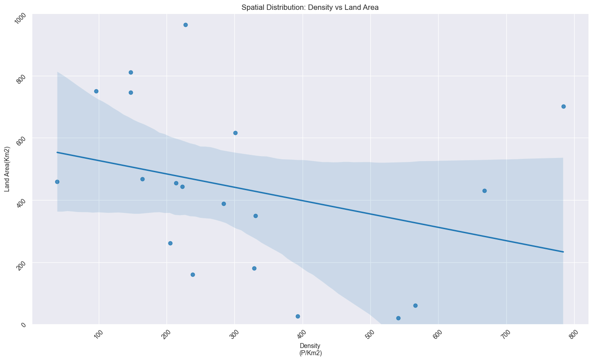
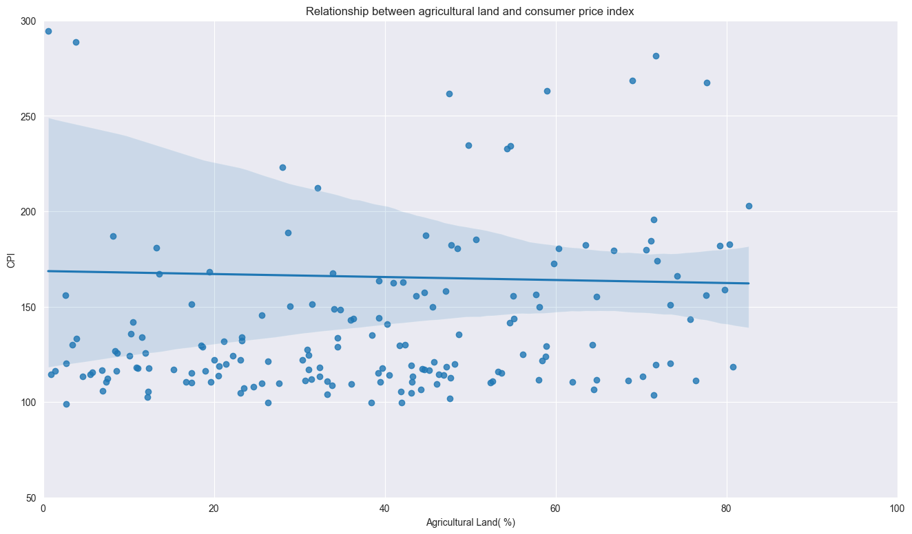
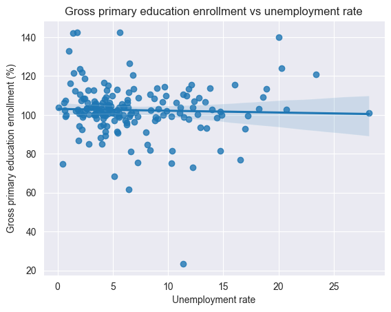
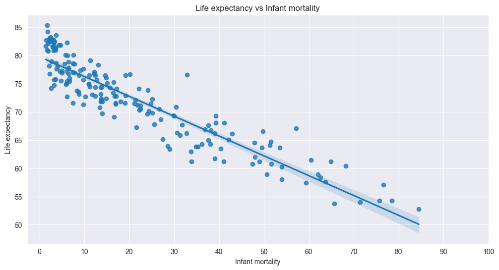
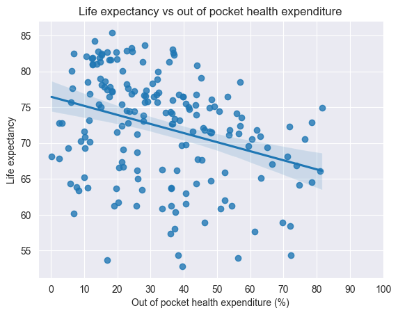
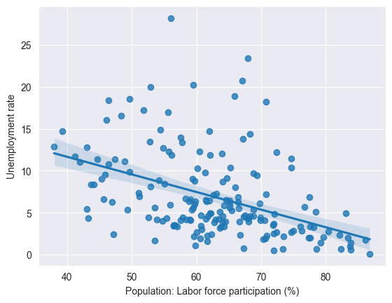
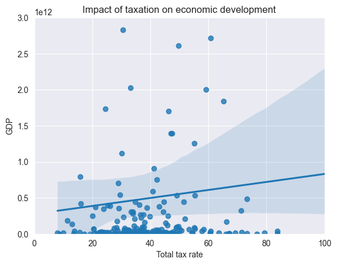
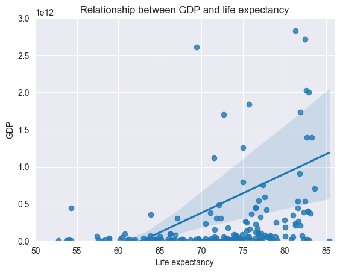
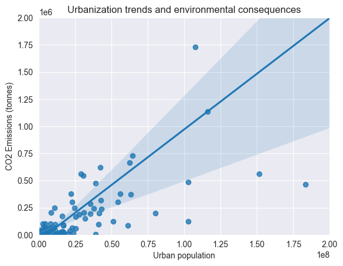

# World Data Analysis
____
This comprehensive dataset provides a wealth of information about all countries worldwide, covering a wide range of
indicators and attributes. It encompasses demographic statistics, economic indicators, environmental factors,
healthcare metrics, education statistics, and much more.
## Data preparation

```Python
world_data_filepath = "C:.../world-data-2023.csv"
world_data = pd.read_csv(world_data_filepath)
test_data = world_data.copy()
world_data.shape
```
## Exploring Spatial Distribution of Population Density and Land Area
____
In order to extract relevant insights, I conducted an analysis on a dataset containing global data. The dataset included key variables such as "Density (P/Km2)" and "Land Area(Km2)". To ensure data integrity, I initially examined the presence of missing values within these columns.

To ascertain the extent of missing values, I used the following code:
```Python
print(test_data.loc[test_data.loc[:, "Density\n(P/Km2)"].isnull()].shape)
print(test_data.loc[test_data.loc[:, "Land Area(Km2)"].isnull()].shape)
```
The analysis revealed that there were no missing values for population density, while there was a solitary missing value for land area. Given the small number of missing values and the dataset's total of 195 rows, I made the decision to drop the affected row. This approach wouldn't significantly impact the final results.

Next, I proceeded by removing the missing values and converting the columns into a numeric format. The following code snippet outlines this process:
```Python
# Drop missing values and transit the columns into numeric format
world_data_density = test_data.dropna(subset=["Density\n(P/Km2)", "Land Area(Km2)"])
world_data_density["Density\n(P/Km2)"] = pd.to_numeric(world_data_density.loc[:, "Density\n(P/Km2)"], errors='coerce')
world_data_density["Land Area(Km2)"] = pd.to_numeric(world_data_density.loc[:, "Land Area(Km2)"], errors='coerce')
```
To visually explore the relationship between population density and land area, I utilized a scatter plot with a regression line. The plot was created using the Seaborn library with the following code:
```Python
# Seting the size of a figure
plt.figure(figsize=(16, 9))

# Creating regplot to study relationship between density and land area
sns.set_style('darkgrid')
sns.regplot(x=world_data_density.loc[:, "Density\n(P/Km2)"], y=world_data_density.loc[:, "Land Area(Km2)"])
plt.title("Spatial Distribution: Density vs Land Area")
plt.xticks(rotation=45)
plt.yticks(rotation=45)

plt.show()
```
The resulting regression plot effectively illustrated the anticipated correlation between land area and population density. As expected, the plot indicated that regions with smaller land areas tend to exhibit higher population densities.

> This analysis provided valuable insights into the spatial distribution of population density and its relationship with land area, aligning with the initial hypothesis.


## Exploring the Relationship between Agricultural Land and Consumer Price Index (CPI)
____
To delve into the possible correlation between agricultural land and the Consumer Price Index (CPI), I began by assessing the presence of missing values in the relevant columns.

I utilized the following code to identify the count of missing values:
```Python
print(test_data.loc[test_data.loc[:, "Agricultural Land( %)"].isnull()].shape)
print(test_data.loc[test_data.loc[:, "CPI"].isnull()].shape)
```
> (7, 35), (17, 35)

The results indicated the presence of 7 missing values in the "Agricultural Land (%)" column and 17 missing values in the "CPI" column.

Subsequently, I applied a similar methodology to generate a regression plot and gain insights into the potential relationship between these variables.

I commenced by excluding rows with missing values using the code:
```Python
# Drop missing values
world_data_agriculture = test_data.dropna(subset=["Agricultural Land( %)", "CPI"])

# Replacing % to convert values in the column from strings into floats
world_data_agriculture["Agricultural Land( %)"] = world_data_agriculture.loc[:, "Agricultural Land( %)"].str.rstrip('%').astype('float')
# Replacing ',' to convert values in the column from strings into floats
world_data_agriculture["CPI"] = world_data_agriculture.loc[:, "CPI"].str.replace(',', '').astype('float')

# Creating scatterplot and jointplot to study the relationship
plt.figure(figsize=(16, 9))
sns.regplot(x=world_data_agriculture.loc[:, "Agricultural Land( %)"], y=world_data_agriculture.loc[:, "CPI"])
```
> The analysis did not reveal a strong correlation between agricultural land and consumer index prices. The observed trend line exhibited a slightly downward trajectory, suggesting a subtle but not decisive relationship between these variables


## Exploring the Relationship between Gross Primary Education Enrollment and Unemployment Rate
____
In order to investigate the potential connection between Gross Primary Education Enrollment and Unemployment Rate, I applied a similar analytical approach to that of previous investigations.

I initiated the process by eliminating rows containing missing values in the "Unemployment rate" and "Gross Primary Education Enrollment (%)" columns. Subsequently, I converted percentage balues into within the columns to floats:
```Python
world_data_unemployment = test_data.dropna(subset=["Unemployment rate", "Gross primary education enrollment (%)"])
world_data_unemployment["Unemployment rate"] = world_data_unemployment.loc[:, "Unemployment rate"].str.strip('%').astype('float')
world_data_unemployment["Gross primary education enrollment (%)"] = world_data_unemployment.loc[:, "Gross primary education enrollment (%)"].str.rstrip("%").astype('float')

sns.regplot(y=world_data_unemployment.loc[:, "Gross primary education enrollment (%)"], x=world_data_unemployment.loc[:, "Unemployment rate"])
```
> The analysis revealed a slight negative trend; however, this observation alone does not provide sufficient grounds for definitive conclusions. To gain a deeper understanding of the relationship, further analysis is warranted.


## Analysis of healthcare metrics such as infant mortality and life expectancy to assess overall well-being
____
In pursuit of a comprehensive understanding of overall well-being, I delved into the analysis of healthcare metrics, particularly focusing on infant mortality and life expectancy. These metrics serve as pivotal indicators of a population's health and quality of life.

To commence this analysis, I began by assessing the data types of the "Unemployment rate" and "Infant mortality" columns, as well as identifying any missing values in the "Infant mortality" and "Life expectancy" columns. The following code snippet encapsulates these preliminary steps:
```Python
print(test_data[["Infant mortality", "Life expectancy"]].dtypes)
print(test_data.loc[test_data.loc[:, "Infant mortality"].isnull()].shape)
print(test_data.loc[test_data.loc[:, "Life expectancy"].isnull()].shape)
```
> Infant mortality    float64
Life expectancy     float64
dtype: object
(6, 35)
(8, 35)

The output revealed that both the "Infant mortality" and "Life expectancy" columns possess a 'float64' data type. Furthermore, there were 6 missing values in the "Infant mortality" column and 8 missing values in the "Life expectancy" column.

With these insights, I promptly progressed to construct a regression plot, aiming to visualize the relationship between infant mortality and life expectancy. The code snippet below illustrates this procedure:
```Python
test_data.dropna(subset=["Infant mortality", "Life expectancy"])

plt.figure(figsize=(12, 6))
sns.regplot(x=test_data.loc[:, 'Infant mortality'], y=test_data.loc[:, "Life expectancy"])
```

> The outcome of this analysis unveiled a pronounced relationship between these healthcare metrics


Building on this understanding, I proceeded to explore another critical relationship, this time between life expectancy and out-of-pocket health expenditures as a percentage of total health expenditures. It is common sense that higher healthcare spending could potentially correlate with increased life expectancy.

To substantiate this hypothesis, I augmented the analysis by converting the "Out of pocket health expenditure" column into a numeric format. With the data now appropriately formatted, I depicted the relationship between out-of-pocket health expenditures and life expectancy using a regression plot:
```Python
world_data_health["Out of pocket health expenditure"] = world_data_health.loc[:, "Out of pocket health expenditure"].str.rstrip('%').astype('float')
sns.regplot(x=world_data_health.loc[:, 'Out of pocket health expenditure'], y=world_data_health.loc[:, "Life expectancy"])
```
> The outcome of this analysis aligned with the expectations, affirming that regions where individuals need to allocate a larger percentage of their income for healthcare expenses tend to exhibit lower life expectancies.


## Analyzing Market Dynamics through Labor Force Participation and Unemployment Rate
____
Exploring market dynamics is pivotal to understanding the complex interplay between various indicators. In this context, I delved into the relationship between labor force participation and the unemployment rate, utilizing these indicators of economic health as crucial.

I commenced by conducting an analysis of missing values within the "Population: Labor force participation (%)" and "Unemployment rate" columns. This preliminary step laid the foundation for robust analysis, ensuring the accuracy of subsequent findings.
```Python
world_data_pop_unempl = test_data.dropna(subset=["Population: Labor force participation (%)", "Unemployment rate"])

world_data_pop_unempl["Population: Labor force participation (%)"] = world_data_pop_unempl.loc[:, "Population: Labor force participation (%)"].astype('str').str.rstrip('%').replace(',', '').astype('float')
world_data_pop_unempl["Unemployment rate"] = world_data_pop_unempl.loc[:, "Unemployment rate"].astype('str').str.rstrip('%').replace(',', '').astype('float')

sns.regplot(x=world_data_pop_unempl.loc[:, "Population: Labor force participation (%)"], y=world_data_pop_unempl.loc[:, "Unemployment rate"])
```
To understand the result, it is crucial to understand what labor force participation is. Labor force participation 
rate indicates the percentage of all people of working age who are employed or are actively seeking work.
> The analysis yielded a notable insight: regions with higher labor force participation rates tend to exhibit lower unemployment rates. This finding underscores a fundamental economic principle - the more individuals who are either employed or actively seeking work, the lower the overall unemployment rate.


## Exploring Taxation's Role in Economic Development
____
In pursuit of this analysis, I undertook data transformation processes to ensure accuracy and consistency. Notably, I converted the "Total tax rate" column into a numeric format by removing the percentage sign, while simultaneously converting the "GDP" column to a numerical representation by removing commas and dollar signs:
```Python
world_data_gdp["Total tax rate"] = world_data_gdp.loc[:, "Total tax rate"].astype('str').str.rstrip('%').astype('float')
world_data_gdp["GDP"] = world_data_gdp.loc[:, "GDP"].str.replace(',', '').str.strip('$').apply(float)

sns.regplot(y=world_data_gdp.loc[:, "GDP"], x=world_data_gdp.loc[:, "Total tax rate"])
```
> This visual representation highlights an intriguing observation - a positive correlation exists between higher taxation rates and greater GDP. However, it's essential to note that this regplot doesn't clarify whether higher taxation rates drive greater GDP or vice versa. Further analysis is imperative to decipher the causative factors underlying this relationship.


In addition to taxation, I sought to explore another pivotal relationship - that between GDP and life expectancy. This correlation often reflects the quality of life and overall well-being within an economy:

```Python
sns.regplot(y=world_data_gdp.loc[:, "GDP"], x=world_data_gdp.loc[:, "Life expectancy"])
````



## Urbanization trends and environmental consequences
Lastly, I decided to delve into analysis of urbanization trends and environmental consequences, considering these connection to be crucial in terms of understanding global warming.
```Python
world_data_urban = test_data.dropna(subset=["Urban_population", "Co2-Emissions"])

world_data_urban["Urban_population"] = world_data_urban.loc[:, "Urban_population"].str.replace(',', '').astype('float')
world_data_urban["Co2-Emissions"] = world_data_urban.loc[:, "Co2-Emissions"].str.replace(',', '').astype('int')

sns.regplot(x=world_data_urban.loc[:, "Urban_population"], y=world_data_urban.loc[:, "Co2-Emissions"])
```
> I chose not to adjust the scale of this plot so that we can observe a wider range of values. The connection between urban population and CO2 emissions is quite clear.


# Conclusion
____
The analysis results might be obvious, but the main aim of this research was to learn how to use Pandas effectively. I intentionally didn't compare different countries and focused on a different research angle. The dataset did not have categorical variables, and it wasn't very large—just 195 rows and 35 columns. Still, working with this data was a great way to learn and improve my skills.
